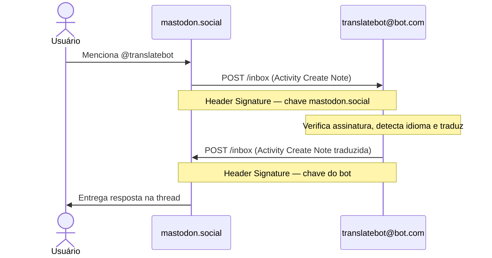

+++
date = '2026-02-27T08:14:37-03:00'
draft = false
title = 'Construindo Bots para o Fediverso com Python e apkit'
+++
> Como implementar um bot ActivityPub funcional — do WebFinger ao HTTP Signature — e os bugs reais que você vai encontrar pelo caminho.

O Fediverso cresce a cada ano, e com ele cresce o interesse de engenheiros em criar aplicações que se integram nativamente ao ecossistema descentralizado. O ActivityPub, padrão W3C desde 2018, é o protocolo que cola tudo isso: Mastodon, Pleroma, Pixelfed e dezenas de outras plataformas falam a mesma língua. A boa notícia para quem escreve Python é que existe uma biblioteca que encapsula a complexidade do protocolo e deixa você focar no que o bot realmente faz.

Este post cobre a construção de um bot de tradução automática — o **[translate-bot](https://github.com/Riverfount/translate-bot)** — como caso de estudo concreto. Ele recebe menções no Mastodon, detecta o idioma do post, traduz com a Google Translate API e responde na thread. Simples de explicar, rico em detalhes de implementação.

---

## O que é ActivityPub, afinal?

Antes de escrever uma linha de código, vale entender os três conceitos centrais do protocolo:

**Actor** é a entidade — usuário, bot, grupo. Cada actor tem um documento JSON-LD exposto publicamente com campos como `inbox`, `outbox` e `publicKey`. Quando o Mastodon quer "conhecer" um bot, é esse documento que ele busca.

**Activity** representa uma ação: `Create` (novo post), `Follow`, `Accept`, `Announce` (boost), `Delete`. Toda interação no Fediverso é uma activity sendo postada no inbox de alguém.

**HTTP Signature** é o mecanismo de autenticidade. Quando um servidor envia uma activity para outro, ele assina o request com sua chave privada RSA. O servidor receptor verifica a assinatura buscando a chave pública no Actor do remetente. Sem isso, qualquer um poderia forjar activities em nome de qualquer conta.

O fluxo de uma menção ao bot é direto:



---

## apkit vs. Mastodon.py: por que não usar a opção mais conhecida?

Quem já trabalhou com bots no Mastodon provavelmente esbarrou no [Mastodon.py](https://mastodonpy.readthedocs.io/), a biblioteca Python mais popular para interagir com o Mastodon. Ela é estável, bem documentada, feature-complete para a API REST do Mastodon 4.4.3, e resolve muito bem casos simples: autenticar com OAuth, postar toots, ler timelines, reagir a notificações via streaming. Para um bot que vive dentro de uma única instância Mastodon e só precisa interagir com a API REST dessa instância, o Mastodon.py é uma escolha válida.

O problema começa quando o objetivo é construir algo que participa do Fediverso como um *servidor* de primeira classe — não como um cliente de uma instância específica. E é aqui que as abordagens divergem fundamentalmente:

| | Mastodon.py | apkit |
|---|---|---|
| **O que é** | Wrapper para a API REST HTTP do Mastodon | Toolkit para o protocolo ActivityPub |
| **Autenticação** | OAuth 2.0 com access token de uma instância | Chaves RSA + HTTP Signatures |
| **Âmbito** | Limitado à instância onde o bot tem conta | Qualquer servidor ActivityPub no Fediverso |
| **Protocolo** | API proprietária do Mastodon (REST/JSON) | W3C ActivityPub (JSON-LD + HTTP) |
| **Dependência** | Precisa de uma conta em uma instância Mastodon | É ele próprio um servidor ActivityPub |
| **WebFinger** | Delegado à instância | Implementado e gerenciado pelo apkit |
| **HTTP Signatures** | Transparente (feito pela instância) | Explícito — você controla chaves e assinaturas |
| **Portabilidade** | Focado em Mastodon (e forks compatíveis) | Funciona com qualquer software ActivityPub |

Com o Mastodon.py, o seu bot é um *usuário* que acessa a API de um servidor Mastodon via OAuth. Toda a complexidade do protocolo — HTTP Signatures, WebFinger, entrega de activities — fica invisível porque é o servidor Mastodon que faz esse trabalho. A contrapartida é que o bot fica preso àquela instância, à sua API específica e aos seus rate limits. Usar o Mastodon.py se parece com isso:

```python
from mastodon import Mastodon

# Autentica via OAuth em uma instância específica
mastodon = Mastodon(access_token="pytooter_usercred.secret", api_base_url="https://mastodon.social")
mastodon.toot("Postando via API REST do Mastodon")

# Para reagir a eventos, é preciso usar o streaming da instância
mastodon.stream_user(MyStreamListener())
```

Com o apkit, o bot é ele mesmo um servidor ActivityPub. Ele tem seu próprio Actor, suas próprias chaves RSA, implementa WebFinger e aceita deliveries direto no inbox. O bot se comunica com qualquer instância do Fediverso — Mastodon, Pleroma, Misskey, Pixelfed — sem intermediários. A complexidade do protocolo fica visível, mas o apkit a encapsula de forma limpa.

Para um bot de tradução que precisa responder menções vindas de *qualquer* servidor do Fediverso, o apkit é a escolha certa. O Mastodon.py exigiria que o bot tivesse uma conta em uma instância específica, e todas as interações passariam por ela — introduzindo um ponto de falha, rate limits da instância e acoplamento ao Mastodon como plataforma.

---

## apkit: o toolkit que cuida do protocolo

O [apkit](https://github.com/fedi-libs/apkit) é um toolkit moderno, construído sobre FastAPI, que encapsula toda a camada do protocolo ActivityPub em módulos bem definidos:

| Módulo | Responsabilidade |
|---|---|
| HTTP Signatures | Assina e verifica requests (suporta draft-cavage, fep8b32, rsa2017) |
| WebFinger | Resolve `acct:user@domain` para a URL do Actor |
| NodeInfo | Expõe metadados do servidor para descoberta no Fediverso |
| Inbox Handler | Recebe e roteia activities por tipo |
| ActivityPubClient | Envia activities com assinatura para inboxes remotos |
| apmodel | Modelos Pydantic para Actor, Note, Create, Follow e outros tipos |

Registrar o bot inteiro leva menos de dez linhas:

```python
from apkit import ActivityPubAPI

api = ActivityPubAPI(
    domain=settings.domain,
    username=settings.bot_username,
    name=settings.bot_display_name,
    summary=settings.bot_summary,
)

# apkit expõe automaticamente:
# GET  /.well-known/webfinger
# GET  /nodeinfo/2.1
# GET  /users/{username}
# POST /users/{username}/inbox

app = api.app  # instância FastAPI — adicione seus endpoints aqui
```

O objeto `api` monta o Actor JSON-LD com todos os campos que o Mastodon exige, configura as rotas e gerencia o WebFinger. Você não escreve nada disso manualmente.

---

## Chaves RSA: o mínimo que você precisa saber

O bot precisa de um par de chaves RSA 2048 bits. A **chave privada** nunca vai para o repositório git — ela assina as activities enviadas. A **chave pública** fica exposta no Actor JSON-LD e é usada pelos servidores remotos para verificar as assinaturas recebidas.

```bash
# Gerar o par de chaves (script incluso no projeto)
uv run python scripts/generate_keys.py
```

O apkit lida com a leitura e publicação automática da chave pública ao servir o Actor. Para assinar uma activity, você passa um `ActorKey` na chamada do cliente:

```python
from apkit.models import ActorKey

key = ActorKey(key_id=f"{bot_url}/users/{username}#main-key", private_key=rsa_private_key)
```

---

## WebFinger: como o Mastodon descobre o bot

Quando um usuário digita `@translatebot@bot.com` no Mastodon, o servidor dele precisa resolver essa identidade para uma URL. O processo é em três etapas:

**1.** O Mastodon faz um GET no endpoint WebFinger do domínio do bot:
```
GET /.well-known/webfinger?resource=acct:translatebot@bot.com
```

**2.** O apkit responde com um documento JRD indicando onde está o Actor:
```json
{
  "subject": "acct:translatebot@bot.com",
  "links": [{
    "rel": "self",
    "href": "https://bot.com/users/translatebot",
    "type": "application/activity+json"
  }]
}
```

**3.** O Mastodon busca o Actor e extrai `inbox` e `publicKey`.

Todo esse fluxo é gerenciado automaticamente pelo apkit. Você não precisa implementar nenhuma dessas rotas.

---

## Pré-requisito importante: o usuário precisa seguir o bot

Antes de mencionar o bot e esperar uma resposta, **o usuário precisa seguir o bot primeiro**. Isso não é uma limitação do translate-bot — é como o protocolo ActivityPub funciona.

No Fediverso, um servidor só entrega activities no inbox de um Actor remoto se houver uma relação estabelecida entre os dois. Quando o usuário segue o bot, ele envia uma activity `Follow` que o bot processa e responde com um `Accept`. A partir daí, o servidor do usuário "conhece" o bot e entrega as menções corretamente. Sem esse handshake inicial, o servidor pode simplesmente descartar a activity ou não conseguir verificar a assinatura por não ter buscado o Actor do bot anteriormente.

O handler de `Follow` no bot é direto:

```python
from apkit.models import Follow

@api.on(Follow)
async def on_follow(ctx):
    activity = ctx.activity
    # Resolve o Actor do seguidor para obter o inbox dele
    async with ActivityPubClient() as client:
        follower_actor = await client.actor.fetch(str(activity.actor))

    # Gera e envia o Accept de volta ao inbox do seguidor
    accept = activity.accept()
    await ctx.send(follower_actor.inbox, accept)

    # Persiste o seguidor no banco de dados para uso futuro
    await save_follower(str(activity.actor), str(follower_actor.inbox))

    return Response(status_code=202)
```

Só após esse `Follow` → `Accept` é que as menções do usuário chegam ao inbox do bot de forma confiável e passam pela verificação de assinatura.

---

## Recebendo e processando uma menção

O handler é registrado com um decorator simples:

```python
from apkit.models import Create
from starlette.responses import Response

def register_handlers(api):
    @api.on(Create)
    async def on_create(ctx):
        # ctx.activity já foi verificado pelo apkit:
        # digest SHA-256 do body ✓
        # assinatura RSA do header Signature ✓
        # desserializado em apmodel (Pydantic) ✓

        await activity_queue.put(ctx.activity)  # ⚠️ enfileirar .activity, não ctx
        return Response(status_code=202)
```

Um detalhe importante: o `ctx` só é válido dentro do escopo do handler. Se você tentar enfileirar `ctx` e acessá-lo depois em um worker assíncrono, vai encontrar comportamento indefinido. A solução é enfileirar `ctx.activity` — o objeto `Create` já desserializado — que é um objeto Pydantic independente do contexto de request.

O bot retorna `202 Accepted` imediatamente porque o Mastodon tem um timeout curto para o endpoint de inbox. A tradução acontece de forma assíncrona em um worker `asyncio`:

```
Inbox Handler → asyncio.Queue → Inbox Worker → BeautifulSoup + Google Translate API
```

---

## Tradução com Google Translate API

O texto que chega no `Note.content` é HTML. A menção ao bot vem como `<span class="mention">@translatebot</span>`, então o primeiro passo é extrair o texto puro com BeautifulSoup antes de chamar a API:

```python
async def translate_text(text: str) -> dict:
    url = f"https://translation.googleapis.com/language/translate/v2?key={API_KEY}"
    payload = {
        "q": text,
        "target": settings.target_language,
        "format": "text"
        # sem "source" → detecção automática de idioma
    }
    async with httpx.AsyncClient() as client:
        response = await client.post(url, json=payload)
    data = response.json()
    return {
        "translated": data["data"]["translations"][0]["translatedText"],
        "detected_source": data["data"]["translations"][0]["detectedSourceLanguage"],
    }
```

Omitir o campo `source` é a escolha certa para um bot de tradução genérico — a API detecta o idioma automaticamente e retorna o código detectado, que você pode usar para montar uma resposta mais informativa como `🌐 [EN → PT] Olá Mundo!`.

---

## Montando e enviando a resposta assinada

```python
from apkit.models import Note, Create, ActorKey
from apkit import ActivityPubClient
from uuid import uuid4
from datetime import datetime, timezone

reply_note = Note(
    id=f"{bot_url}/notes/{uuid4()}",
    attributed_to=bot_actor_url,
    content=reply_html,
    to=[author_url],
    in_reply_to={"id": note.id, "type": "Note"},  # dict → apmodel converte para Object
    tag=[{"type": "Mention", "href": author_url}],
    published=datetime.now(timezone.utc).isoformat(),
)

async with ActivityPubClient() as client:
    async with client.post(
        remote_actor.inbox,
        json=reply_create,
        signatures=[ActorKey(key_id=key_id, private_key=rsa_private_key)],
        sign_with=["draft-cavage"],  # ← crucial, veja a próxima seção
    ) as response:
        log.info(f"Resposta entregue. Status: {response.status}")
```

---

## O bug que vai te pegar: divergência no HTTP Signature Digest

Este é o tipo de problema que não aparece na documentação e você só descobre em produção (ou quase).

Por padrão, o apkit usa `sign_with=['draft-cavage', 'rsa2017', 'fep8b32']`. O **rsa2017** (LD Signature) **modifica o body JSON** adicionando uma assinatura embutida no próprio payload. O problema: o digest HTTP é calculado sobre o body *antes* dessa modificação, mas o `aiohttp` envia o body *depois*. Resultado:

```json
{"error": "Invalid Digest value. Computed SHA-256: 29H35g...; given: wiGsZV..."}
```

O Mastodon calcula o digest do body que recebe, compara com o digest assinado no header — e eles não batem porque são corpos diferentes.

A solução é simples e definitiva: usar apenas `draft-cavage`:

```python
# ❌ Padrão do apkit — rsa2017 corrompe o digest
client.post(url, json=activity, signatures=[ActorKey(...)])

# ✅ Correto para compatibilidade com Mastodon
client.post(url, json=activity, signatures=[ActorKey(...)], sign_with=["draft-cavage"])
```

Para compatibilidade com Mastodon, `draft-cavage` sozinho é suficiente. LD Signatures só fazem sentido se você precisa de portabilidade do próprio objeto JSON fora do contexto HTTP.

---

## Testando código que usa apkit

A suíte de testes do translate-bot tem 96 testes cobrindo handlers, worker, rotas e integração. Alguns padrões foram aprendidos na prática:

**`ActivityPubClient` é usado duas vezes no worker** — uma para buscar o Actor do remetente e outra para postar a resposta. Use `side_effect` com uma lista de mocks, não `return_value`:

```python
# ❌ Errado — return_value retorna o mesmo mock para todas as chamadas
mock_client = MagicMock()
patch("workers.ActivityPubClient", return_value=mock_client)

# ✅ Correto — side_effect percorre a lista em ordem
patch.object(worker_module, "ActivityPubClient",
             side_effect=[mock_fetch_client, mock_post_client])
```

**`MagicMock()` não passa em `isinstance(key, RSAPrivateKey)`** — o apkit valida o tipo da chave internamente. Use uma chave RSA real nos testes:

```python
from cryptography.hazmat.primitives.asymmetric import rsa

def _make_rsa_key():
    return rsa.generate_private_key(public_exponent=65537, key_size=2048)
```

**Use `patch.object(module, ...)` em vez de `patch("path.to.module")`** para evitar problemas de cache do `sys.modules` quando o módulo já foi importado antes do patch ser aplicado.

O padrão completo fica assim:

```python
import workers.inbox_worker as worker_module

with (
    patch.object(worker_module, "ActivityPubClient",
                 side_effect=[mock_fetch_client, mock_post_client]),
    patch.object(worker_module, "get_bot_keys",
                 AsyncMock(return_value=[
                     ActorKey(key_id=f"{bot_url}#main-key",
                              private_key=_make_rsa_key())
                 ])),
):
    await worker_module.handle_create(activity)

mock_post_client.__aenter__.return_value.post.assert_called_once()
```

---

## O fluxo completo em oito passos

Para ter a visão de ponta a ponta:

1. Usuário segue `@translatebot@bot.com` → bot responde com `Accept` e persiste o follower
2. Usuário posta `@translatebot@bot.com "Bonjour tout le monde"` no Mastodon
3. Mastodon resolve `@translatebot@bot.com` via WebFinger → descobre o inbox
4. Mastodon envia um `Create` assinado para o inbox do bot
5. apkit verifica digest SHA-256 e assinatura RSA do remetente
6. Handler enfileira `ctx.activity` e retorna `202` imediatamente
7. Worker asyncio extrai texto puro com BeautifulSoup e chama a Google Translate API
8. Bot monta `Note` + `Create`, assina com `draft-cavage` e entrega no inbox do autor

---

## Conclusão

O ActivityPub tem uma curva de aprendizado real — HTTP Signatures, JSON-LD, WebFinger e a semântica das activities envolvem bastante especificação. A escolha entre Mastodon.py e apkit não é uma questão de qualidade das bibliotecas, mas de modelo arquitetural: se o bot é um cliente de uma instância, Mastodon.py resolve. Se o bot é um servidor independente no Fediverso, apkit é o caminho.

O translate-bot é um exemplo completo de como compor essas peças: receber e verificar uma menção, processar de forma assíncrona, chamar uma API externa e entregar uma resposta assinada. O bug do digest HTTP vale como lembrete geral: quando você empilha múltiplos mecanismos de assinatura sobre o mesmo payload, é fácil criar inconsistências silenciosas que só aparecem em produção. Leia o que cada opção faz antes de aceitar o padrão.

O código completo está em [github.com/Riverfount/translate-bot](https://github.com/Riverfount/translate-bot) e o apkit em [github.com/fedi-libs/apkit](https://github.com/fedi-libs/apkit). 

Dúvidas, sugestões ou só quiser trocar uma ideia sobre ActivityPub e Python, pode me encontrar no Fediverso em [@riverfount@bolha.us](https://bolha.us/@riverfount).
